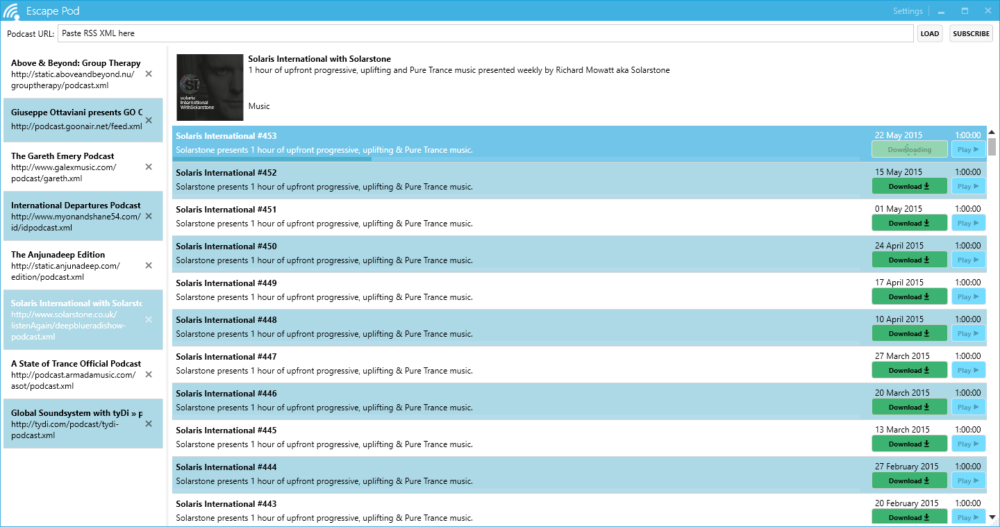

# Escape-Pod

Escape Pod is a podcast downloader. It removes the need for iTunes and provides a lightweight, modern app for downloading podcast episodes. All you need is the .xml RSS URL. Comes pre-loaded with selection of trance podcast subscriptions.[Download zero install exe](EscapePod/bin/EscapePod.exe?raw=true)

### Technologies

- WPF
- ASP.NET Web API error reporting
- [MahApps](http://mahapps.com/) UI toolkit
- [Costura.Fody](https://github.com/Fody/Costura) Dependency packaging
- Unity
- Json.NET
- log4net
